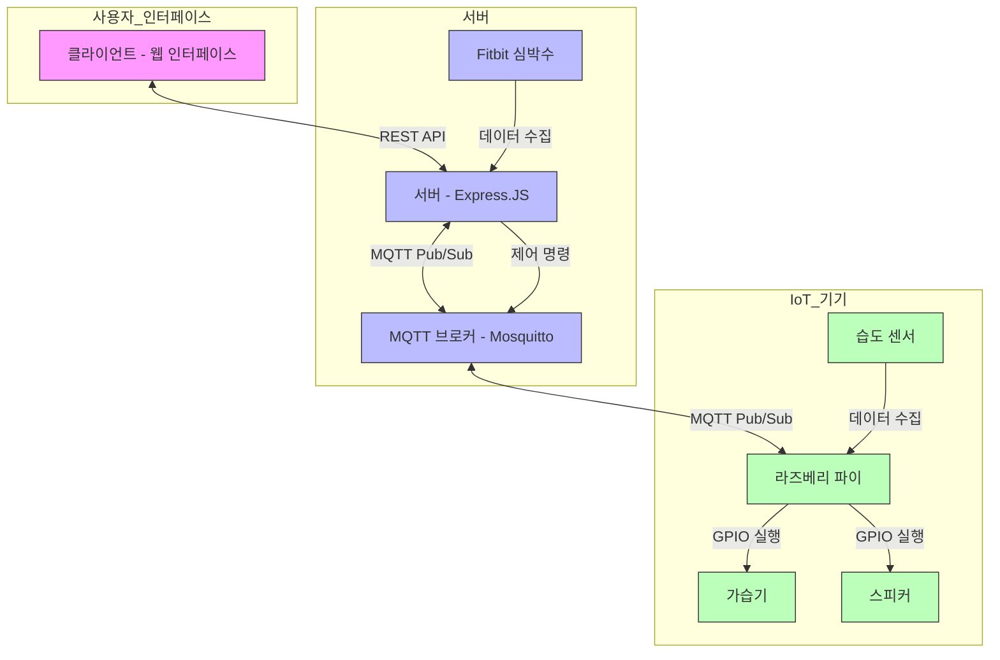

# 딥슬립 시스템 아키텍처

## 시스템 개요

딥슬립은 수면 중 습도와 심박수 데이터를 실시간으로 모니터링하고, 이를 기반으로 가습기와 스피커를 자동 제어하는 온프레미스 스마트 헬스케어 시스템입니다.

## 아키텍처 구성

## 컴포넌트 구성

1. **클라이언트 (웹 인터페이스)**

   - 사용자가 시스템을 모니터링하고 제어할 수 있는 웹 인터페이스
   - 실시간 센서 데이터 표시 및 기기 제어 기능 제공
   - HTML, CSS, JavaScript와 Axios.JS를 사용하여 개발

2. **서버 (Express.JS)**

   - RESTful API 엔드포인트 제공
   - MQTT 클라이언트 내장하여 IoT 기기와 통신
   - 사용자 요청 처리 및 데이터 관리
   - Fitbit API를 통한 심박수 데이터 수집
   - 디바이스 제어 로직 처리 및 명령 생성

3. **MQTT 브로커 (Mosquitto)**

   - 서버와 라즈베리 파이 간의 통신 중개
   - Pub/Sub 방식으로 메시지 교환
   - Docker를 사용하여 쉽게 배포 가능

4. **라즈베리 파이**
   - 습도 센서 데이터 수집
   - 서버로부터 수신한 제어 명령에 따라 GPIO를 통한 가습기와 스피커 제어
   - MQTT를 통해 서버와 통신

## 데이터 흐름

1. 라즈베리 파이가 습도 센서에서 데이터 수집
2. 서버가 Fitbit API를 통해 심박수 데이터 수집
3. 센서 데이터는 MQTT를 통해 서버로 전송됨
4. 서버는 데이터를 처리하고 디바이스 제어 결정을 내림
5. 제어 명령은 MQTT를 통해 라즈베리 파이로 전송
6. 라즈베리 파이는 GPIO를 통해 가습기와 스피커 제어 명령 실행
7. 웹 클라이언트는 서버의 RESTful API를 호출하여 데이터 조회 및 수동 제어 요청

## API 구조

모든 API는 RESTful 방식으로 설계되었으며, 다음과 같은 주요 엔드포인트를 제공합니다:

- **GET /api/sleep/status**: 현재 수면 환경 상태 조회
- **GET /api/sleep/records**: 수면 데이터 이력 조회
- **POST /api/device/humidifier**: 가습기 제어
- **POST /api/device/speaker**: 스피커 제어
- **POST /api/settings/automation**: 자동화 설정 업데이트

## MQTT 토픽 구조

- **sensors/sleep/humidity**: 습도 센서 데이터
- **sensors/sleep/heartrate**: 심박수 데이터
- **control/humidifier**: 가습기 제어 명령
- **control/speaker**: 스피커 제어 명령
- **settings/automation**: 자동화 설정 업데이트

## 자동화 로직

시스템은 다음과 같은 자동화 로직을 기본으로 제공합니다:

1. 습도가 설정 임계값(기본값 40%) 이하로 떨어지면 가습기 자동 작동
2. 심박수가 설정 임계값(기본값 80bpm) 이상으로 올라가면 백색소음 자동 재생
3. 조건이 정상화되면 자동으로 기기 작동 중지
